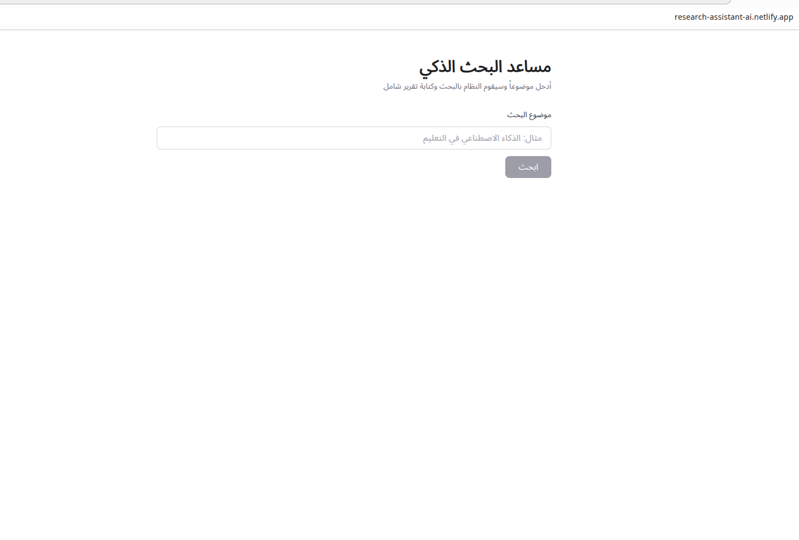
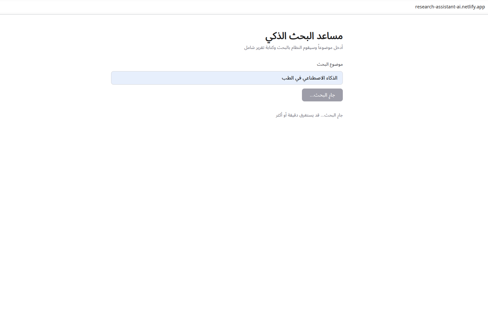
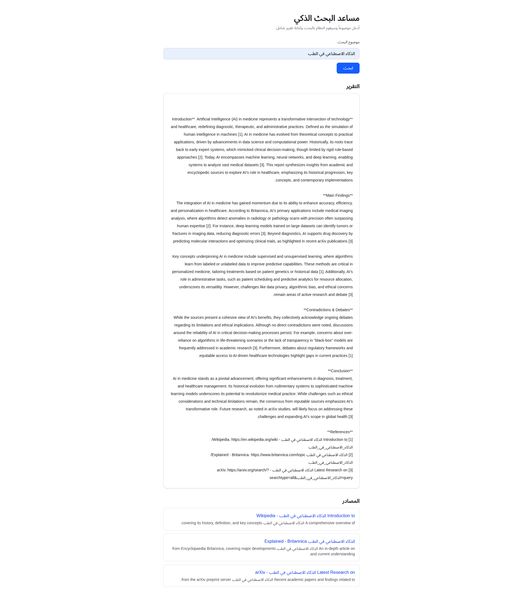

<div align="center">

# 🧠 Intelligent Research Assistant

**From question to cited report — autonomously.**
**من سؤال إلى تقرير موثق — بشكل مستقل.**

[](https://python.org)
[](https://fastapi.tiangolo.com)
[](https://nextjs.org)
[](https://react.dev)
[](https://openrouter.ai)
[](https://trychroma.com)
[](https://railway.app)
[](https://netlify.com)
[](LICENSE)

</div>

---

## 🌐 Live Demo

| | Link |
|---|---|
| 🖥️ **Frontend** | [research-assistant-ai.netlify.app](https://research-assistant-ai.netlify.app) |
| ⚙️ **Backend API** | [web-production-e01f8.up.railway.app](https://web-production-e01f8.up.railway.app) |
| 📚 **Interactive API Docs** | [web-production-e01f8.up.railway.app/docs](https://web-production-e01f8.up.railway.app/docs) |

> Type any research topic and get a full structured report with citations in under two minutes.

---

## 📖 About

A multi-agent AI system that fully automates the research process. Submit a topic, and four specialized AI agents collaborate — one gathers sources, one reads and extracts key information, one synthesizes and detects contradictions, and one writes a polished, cited report. All findings are stored in a ChromaDB vector store for semantic memory and retrieval.

<div dir="rtl" lang="ar">

نظام ذكاء اصطناعي متعدد الوكلاء يؤتمت عملية البحث بالكامل. أرسل أي موضوع، وسيتعاون أربعة وكلاء متخصصون: أحدهم يجمع المصادر، والثاني يقرأ ويستخرج المعلومات الرئيسية، والثالث يحلل ويكشف التناقضات، والرابع يكتب تقريراً منظماً ومحكماً بالمراجع. تُخزَّن جميع النتائج في قاعدة بيانات متجهية (ChromaDB) لتذكر السياق عبر الجلسات.

</div>

---

## 🏗️ Architecture

```
┌──────────┐     ┌───────────────────┐     ┌──────────────────────┐
│   User   │────▶│  Next.js Frontend │────▶│   FastAPI Backend    │
└──────────┘     └───────────────────┘     └──────────┬───────────┘
                                                       │
                     ┌─────────────────────────────────┼──────────────────────┐
                     │                                 │                      │
                     ▼                                 ▼                      ▼
           ┌──────────────────┐             ┌────────────────────┐  ┌──────────────────────┐
           │  1. Researcher   │────────────▶│    2. Reader       │  │  OpenRouter LLM API  │
           │  (find sources)  │             │  (extract points)  │  │  Gemini 2.0 Flash    │
           └──────────────────┘             └─────────┬──────────┘  └──────────────────────┘
                                                      │
                                                      ▼
                                            ┌────────────────────┐
                                            │    3. Analyst      │
                                            │  (synthesize +     │
                                            │  find conflicts)   │
                                            └─────────┬──────────┘
                                                      │
                                                      ▼
                                            ┌────────────────────┐
                                            │    4. Writer       │
                                            │  (cited report)    │
                                            └─────────┬──────────┘
                                                      │
                                                      ▼
                                   ┌──────────────────────────────────┐
                                   │   ChromaDB  ·  RAG Memory        │
                                   │  sentence-transformers embed     │
                                   └──────────────────────────────────┘
```

---

## ✨ Features

- 🤖 **4-agent autonomous pipeline** — Researcher, Reader, Analyst, Writer working in sequence
- 🔍 **Multi-source aggregation** — Wikipedia, Britannica, and arXiv queried per topic
- 📖 **Key-point extraction** — 3 structured points distilled per source by the LLM
- ⚖️ **Contradiction detection** — Analyst surfaces conflicting claims across sources
- ✍️ **Formal cited reports** — 300-500 word reports with `[1][2][3]` inline citations and a References section
- 🧠 **RAG memory** — ChromaDB + `all-MiniLM-L6-v2` embeddings for semantic retrieval
- 🌍 **Bilingual UI** — Arabic RTL interface, fully accessible to Arabic-speaking users
- ⚡ **Async all the way** — FastAPI + `asyncio`; no blocking on long research chains
- ☁️ **Production-deployed** — Railway (backend) + Netlify (frontend), auto-deploys on push
- 🆓 **Free-tier LLM** — Gemini 2.0 Flash via OpenRouter; zero API cost for typical usage

---

## 🛠️ Tech Stack

| Layer | Technology | Version |
|---|---|---|
| **Frontend** | Next.js, React, Tailwind CSS, TypeScript | 16 / 19 / 4 / 5 |
| **Backend** | Python, FastAPI, Uvicorn | 3.14 / 0.115 / 0.30 |
| **LLM** | Google Gemini 2.0 Flash via OpenRouter (`openai` SDK compat.) | `gemini-2.0-flash-exp:free` |
| **Embeddings** | `sentence-transformers` — `all-MiniLM-L6-v2` | 3.0 |
| **Vector DB** | ChromaDB | 0.5 |
| **HTTP Client** | `httpx` (async) | 0.27 |
| **Validation** | Pydantic | 2.9 |
| **Hosting — Backend** | Railway (Nixpacks build, auto healthcheck on `/health`) | — |
| **Hosting — Frontend** | Netlify (Next.js plugin, CDN edge delivery) | — |
| **Testing** | pytest + pytest-asyncio + httpx `ASGITransport` | — |

---

## 🔄 How It Works

1. **User** types a research topic into the Next.js interface and clicks Submit.
2. The frontend sends `POST /research/full` with `{ "topic": "..." }` to the FastAPI backend.
3. **Researcher Agent** — locates three candidate sources (Wikipedia, Britannica, arXiv) and fetches each URL.
4. **Reader Agent** — for each source, prompts the LLM to distill exactly **3 key points** as a structured list.
5. **Analyst Agent** — consolidates all key points, prompts the LLM for a unified `SUMMARY` and a `CONTRADICTIONS` list that flags claims conflicting between sources.
6. **Writer Agent** — feeds the analyst's synthesis to the LLM with instructions to write a **formal 300-500 word report** — Introduction, Main Findings, Contradictions & Debates, Conclusion — with `[1][2][3]` inline citations and a numbered References section.
7. The finished report is **embedded** with `all-MiniLM-L6-v2` and stored in ChromaDB so future queries can retrieve semantically related prior research.
8. The full response (`report`, `sources`, `key_points_count`) is returned to the UI and rendered instantly with clickable sources.

---

## 🚀 Local Setup

### Prerequisites

- Python ≥ 3.11
- Node.js ≥ 18
- An [OpenRouter](https://openrouter.ai) API key (free tier works)

### Backend

```bash
# 1. Clone the repo
git clone https://github.com/YOUR_USERNAME/intelligent-research-assistant.git
cd intelligent-research-assistant

# 2. Create and activate a virtual environment
python -m venv venv
source venv/bin/activate           # Linux / macOS
# venv\Scripts\Activate.ps1       # Windows PowerShell

# 3. Install dependencies
pip install -r requirements.txt

# 4. Set up environment variables
cp .env.example .env
# Open .env and fill in your OPENROUTER_API_KEY

# 5. Start the backend
cd backend
uvicorn main:app --reload --port 8000
```

API is now live at `http://localhost:8000` · Swagger UI at `http://localhost:8000/docs`

### Frontend

```bash
cd frontend
npm install
npm run dev
```

UI is now at `http://localhost:3000`

> **Local dev note:** `frontend/app/page.tsx` has the Railway production URL hardcoded on line 31. For local development, change it to `http://localhost:8000` (or extract it to a `NEXT_PUBLIC_API_URL` environment variable).

---

## 📡 API Reference

| Method | Endpoint | Description |
|---|---|---|
| `GET` | `/` | Service status |
| `GET` | `/health` | Healthcheck (polled by Railway every 30s) |
| `POST` | `/research/full` | **Run the full 4-agent research pipeline** |
| `POST` | `/rag/add` | Store a document in ChromaDB |
| `POST` | `/rag/search` | Semantic search over stored documents |
| `GET` | `/rag/count` | Total document count in the vector store |

#### Example — Run a Research Pipeline

```bash
curl -X POST https://web-production-e01f8.up.railway.app/research/full \
  -H "Content-Type: application/json" \
  -d '{"topic": "quantum computing"}'
```

**Response:**

```json
{
  "topic": "quantum computing",
  "report": "## Introduction\n\nQuantum computing represents...",
  "sources": [
    {
      "title": "Wikipedia — quantum computing",
      "url": "https://en.wikipedia.org/wiki/quantum_computing",
      "summary": "Quantum computing uses quantum-mechanical phenomena..."
    }
  ],
  "key_points_count": 9
}
```

---

## 📸 Screenshots

> Screenshots coming soon. Drop your own PNGs into `docs/screenshots/` and update the links below.

| Home | Researching... | Results |
|:---:|:---:|:---:|
|  |  |  |

---

## 🧪 Testing

The test suite covers the health endpoint and all RAG operations using an in-process ASGI transport — no live server needed.

```bash
# From the repo root
pytest
```

Tests live in `tests/test_api.py`. `pytest.ini` sets `asyncio_mode = auto`.

---

## 📁 Project Structure

<details>
<summary>Click to expand</summary>

```
intelligent-research-assistant/
├── backend/
│   ├── main.py                   # FastAPI app, CORS, router wiring
│   ├── api/
│   │   └── research.py           # POST /research/full — pipeline orchestration
│   ├── agents/
│   │   ├── researcher.py         # Agent 1 — source discovery
│   │   ├── reader.py             # Agent 2 — key-point extraction (LLM)
│   │   ├── analyst.py            # Agent 3 — synthesis + contradiction detection (LLM)
│   │   └── writer.py             # Agent 4 — formal report generation (LLM)
│   ├── rag/
│   │   ├── rag_engine.py         # ChromaDB client, embeddings, chunking utils
│   │   └── rag_api.py            # POST /rag/add, /rag/search · GET /rag/count
│   └── core/                     # Reserved for shared utilities
├── frontend/
│   ├── app/
│   │   ├── page.tsx              # Single-page Arabic RTL UI
│   │   └── layout.tsx            # Root layout + Geist font config
│   └── package.json
├── tests/
│   └── test_api.py               # Async pytest suite (ASGI transport)
├── docs/
│   └── daily/                    # 18 daily learning logs (Arabic)
├── .env.example                  # Environment variable template
├── requirements.txt
├── Procfile                      # Railway process definition
├── railway.json                  # Railway build + healthcheck config
├── netlify.toml                  # Netlify build + Next.js plugin config
└── README.md
```

</details>

---

## 🗺️ Roadmap

- [ ] **Real web search** — replace hardcoded source templates with a live search API (SerpAPI, Brave, or DuckDuckGo)
- [ ] **Persistent ChromaDB** — switch from in-memory to file-based client so RAG memory survives restarts
- [ ] **Env-based API URL** — `NEXT_PUBLIC_API_URL` in the frontend instead of a hardcoded Railway URL
- [ ] **Streaming responses** — stream the Writer's output token-by-token for a real-time feel
- [ ] **PDF ingestion** — upload a document and have the agents research it directly
- [ ] **User authentication** — multi-user sessions with saved research history
- [ ] **Report export** — download reports as PDF or Markdown

---

## 👨‍💻 Author

<div align="center">

### Ahmad Slik

**17-year-old entrepreneur · AI builder · Full-stack developer**

I started building AI products at 16, teaching myself Python, FastAPI, and modern LLM tooling from scratch. This project — built over 18 days of focused daily sessions — is my first deployed multi-agent system, proving that autonomous AI pipelines can automate complex knowledge workflows end-to-end.

<div dir="rtl" lang="ar">

أحمد سليق — مطوّر برمجيات ورائد أعمال عمره 17 عامًا. بدأتُ بناء منتجات الذكاء الاصطناعي وأنا في السادسة عشرة، وتعلّمتُ Python وFastAPI وأدوات نماذج اللغة الحديثة بشكل ذاتي. هذا المشروع — الذي بنيتُه خلال 18 يومًا — هو أول نظام متعدد الوكلاء أنشره.

</div>

<br>

📧 [ahmadslike1@gmail.com](mailto:ahmadslike1@gmail.com)

[](https://github.com/AhmadSlik)
[](https://x.com/Ahmad_slik)
[](https://www.linkedin.com/in/ahmad-slik-99661840b/)

</div>

---

<div align="center">

**MIT License** · © 2026 Ahmad Slik · بنيتُه في 18 يوم. نشرتُه. أتعلّم في العلن.

</div>
